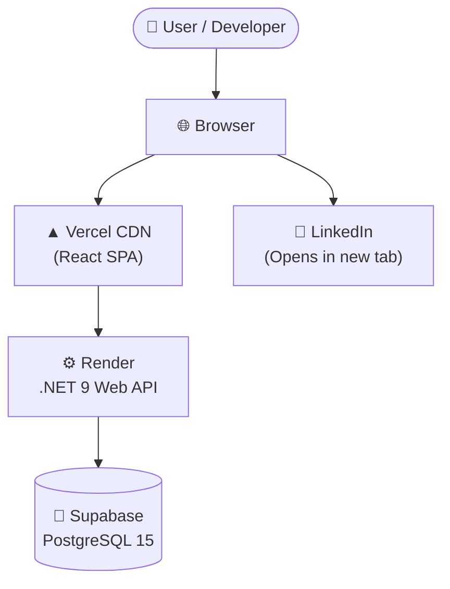

# NextApply Job Tracker – Architecture Overview

NextApply Job Tracker is a comprehensive job application tracking system designed for a .NET/Full-Stack developer. It manages and organizes applications across 590+ companies, enabling efficient tracking of job statuses, follow-up actions, and interview processes.

## High-Level Architecture



## Technology Stack

| Layer | Technology | Version | Purpose |
|-------|-----------|---------|--------|
| Frontend Framework | React | 18 | UI rendering |
| Build Tool | Vite | 8 | Dev server, bundling |
| Language | TypeScript | 5 | Type safety |
| State Management | React Context API | — | Global app state |
| Data Fetching | TanStack Query | v5 | Server state, caching |
| Row Virtualization | @tanstack/react-virtual | v3 | Virtual scroll for large tables |
| Icons | Lucide React | latest | Icon system |
| CSS | Vanilla CSS Custom Properties | — | Theming, layout |
| Backend Framework | ASP.NET Core | .NET 9 | REST API |
| ORM | Entity Framework Core | 9 | Database access |
| Database | PostgreSQL | 15 | Data persistence |
| DB Host | Supabase | — | Managed PostgreSQL |
| Frontend Host | Vercel | — | CDN + SPA hosting |
| Backend Host | Render | — | Web service hosting |

## Deployment Topology

The application relies on a modern serverless and PaaS deployment strategy:
- **Vercel**: Hosts the React Single Page Application (SPA). Vercel provides a fast, global CDN that serves the statically built frontend files.
- **Render**: Hosts the ASP.NET Core Web API. Render provides a scalable platform for running the .NET 9 web services.
- **Supabase**: Hosts the PostgreSQL database. Supabase provides a fully managed, scalable cloud database solution with built-in connection pooling.

## Environment Variables

| Variable | Used In | Description |
|----------|---------|-------------|
| `VITE_API_URL` | Frontend | Backend API base URL |
| `ApiKey` | Backend appsettings | Shared secret for X-Api-Key header auth |
| `ConnectionStrings__DefaultConnection` | Backend | Supabase PostgreSQL connection string |

## Auth Flow

The API utilizes a straightforward header-based authentication mechanism using an API key (`X-Api-Key`). 
- The backend's `ApiKeyAuthMiddleware` intercepts every incoming request and validates the provided key against the configured `ApiKey` in the server's settings.
- The frontend securely reads this key from `localStorage.getItem('apiKey')` and attaches it to the headers of every outgoing API request.
- Unauthorized requests are rejected immediately, ensuring data protection.

## Repository Structure

```
Job-Tracker/
├── frontend/          # React + TypeScript SPA
│   ├── src/
│   │   ├── components/  # UI components
│   │   ├── hooks/       # TanStack Query hooks
│   │   ├── services/    # API client, Excel adapter
│   │   ├── state/       # Global context store
│   │   ├── types/       # TypeScript types
│   │   └── utils/       # LinkedIn URL builders, helpers
│   └── public/
├── backend/
│   └── NextApply.Api/   # .NET 9 REST API
│       ├── Controllers/
│       ├── Models/
│       ├── DTOs/
│       ├── Data/        # EF Core DbContext
│       ├── Middleware/  # API key auth
│       └── Migrations/
├── sheets/              # Master Excel tracking files
├── docs/                # This documentation
└── archive/
```
