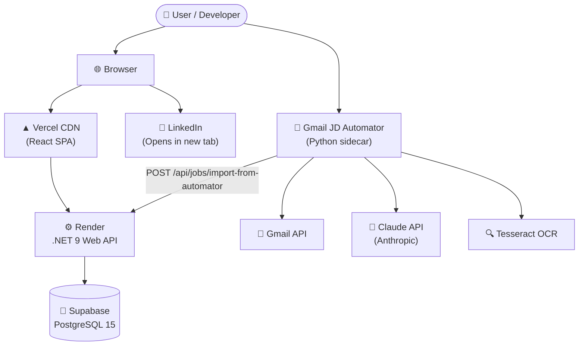

# NextApply Job Tracker – Architecture Overview

NextApply Job Tracker is a comprehensive job application tracking system designed for a .NET/Full-Stack developer. It manages and organizes applications across 590+ companies, enabling efficient tracking of job statuses, follow-up actions, and interview processes.

## High-Level Architecture



## Technology Stack

| Layer | Technology | Version | Purpose |
|-------|-----------|---------|--------|
| Frontend Framework | React | 18 | UI rendering |
| Build Tool | Vite | 8 | Dev server, bundling |
| Language | TypeScript | 5 | Type safety |
| State Management | React Context API | — | Global app state |
| Data Fetching | TanStack Query | v5 | Server state, caching |
| Row Virtualization | @tanstack/react-virtual | v3 | Virtual scroll for large tables |
| Icons | Lucide React | latest | Icon system |
| CSS | Vanilla CSS Custom Properties | — | Theming, layout |
| Backend Framework | ASP.NET Core | .NET 9 | REST API |
| ORM | Entity Framework Core | 9 | Database access |
| Database | PostgreSQL | 15 | Data persistence |
| DB Host | Supabase | — | Managed PostgreSQL |
| Frontend Host | Vercel | — | CDN + SPA hosting |
| Backend Host | Render | — | Web service hosting |

## Deployment Topology

The application relies on a modern serverless and PaaS deployment strategy:
- **Vercel**: Hosts the React Single Page Application (SPA). Vercel provides a fast, global CDN that serves the statically built frontend files.
- **Render**: Hosts the ASP.NET Core Web API. Render provides a scalable platform for running the .NET 9 web services.
- **Supabase**: Hosts the PostgreSQL database. Supabase provides a fully managed, scalable cloud database solution with built-in connection pooling.

## Environment Variables

| Variable | Used In | Description |
|----------|---------|-------------|
| `VITE_API_URL` | Frontend | Backend API base URL |
| `ApiKey` | Backend appsettings | Shared secret for X-Api-Key header auth |
| `ConnectionStrings__DefaultConnection` | Backend | Supabase PostgreSQL connection string |

## Auth Flow

The API utilizes a straightforward header-based authentication mechanism using an API key (`X-Api-Key`). 
- The backend's `ApiKeyAuthMiddleware` intercepts every incoming request and validates the provided key against the configured `ApiKey` in the server's settings.
- The frontend securely reads this key from `localStorage.getItem('apiKey')` and attaches it to the headers of every outgoing API request.
- Unauthorized requests are rejected immediately, ensuring data protection.

## Repository Structure

```
Job-Tracker/
├── frontend/          # React + TypeScript SPA
│   ├── src/
│   │   ├── components/  # UI components
│   │   ├── hooks/       # TanStack Query hooks
│   │   ├── services/    # API client, Excel adapter
│   │   ├── state/       # Global context store
│   │   ├── types/       # TypeScript types
│   │   └── utils/       # LinkedIn URL builders, helpers
│   └── public/
│       └── graph.html       # Graphify architecture visualizer
├── backend/
│   └── NextApply.Api/   # .NET 9 REST API
│       ├── Controllers/
│       │   └── JobApplicationImportController.cs  # [Phase 2]
│       ├── Models/
│       ├── DTOs/
│       ├── Data/        # EF Core DbContext
│       ├── Middleware/  # API key auth
│       └── Migrations/
├── automation/
│   └── gmail-jd-automator/  # Python sidecar — OCR + Claude outreach
├── prompt-lib/              # 11 SDLC system prompts
├── tests/                   # Vitest test suite
├── sheets/              # Master Excel tracking files
├── docs/                # This documentation
│   └── phases/          # Per-phase implementation docs
└── archive/
```

---

## Job Application Automation Layer

The **Gmail JD Automator** (`automation/gmail-jd-automator/`) is a Python sidecar that:

1. Scans Gmail drafts containing job-description screenshots
2. OCRs images with Tesseract to extract JD text
3. Calls Claude to generate a tailored outreach email grounded in the user's resume
4. Creates a new Gmail draft (or sends directly if configured)
5. Optionally POSTs to `POST /api/jobs/import-from-automator` to create a job record in NextApply

This creates a closed loop: outreach is automated **and** tracked in the same platform.

Full documentation: [`docs/08-job-application-module.md`](./08-job-application-module.md)

---

## Documentation Index

| # | Doc | Contents |
|---|-----|---------|
| 01 | [Architecture Overview](./01-architecture-overview.md) | This file — high-level topology, tech stack, env vars, auth flow |
| 02 | [Frontend](./02-frontend.md) | React component structure, hooks, TanStack Query patterns |
| 03 | [Backend](./03-backend.md) | .NET API endpoints, DTOs, middleware, error handling |
| 04 | [Database](./04-database.md) | PostgreSQL schema, EF Core models, migration history |
| 05 | [Data Flow](./05-data-flow.md) | End-to-end request/response flows |
| 06 | [Design System](./06-design-system.md) | CSS tokens, typography, spacing, color palette |
| 07 | [Feature Reference](./07-feature-reference.md) | Every user-facing feature: purpose, files, API calls |
| 08 | [Job Application Module](./08-job-application-module.md) | Gmail JD Automator PRD + technical docs + API integration |
| 09 | [Prompt Library](./09-prompt-library.md) | Index of all 11 SDLC prompts in `prompt-lib/` |
| 10 | [Graphify Guide](./10-graphify-guide.md) | How to use, extend, and regenerate the architecture graph |
| 11 | [Product Backlog & Defect Log](./BACKLOG.md) | Resolved development errors, completed milestones, and future roadmap |

---

## Architecture Visualizer

An interactive **Graphify Dark Constellation** graph of the full system architecture is available at:

- **Local dev:** `http://localhost:5173/graph`  
- **Direct file:** `frontend/public/graph.html`

See [`docs/10-graphify-guide.md`](./10-graphify-guide.md) for details.
