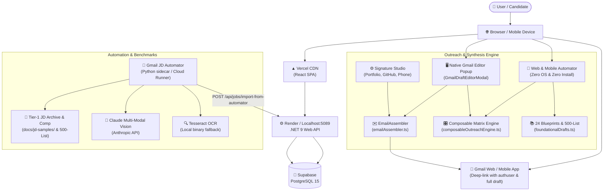

# NextApply Job Tracker – Architecture Overview

NextApply Job Tracker is a comprehensive job application tracking system designed for a .NET/Full-Stack developer. It manages and organizes applications across 590+ companies, enabling efficient tracking of job statuses, follow-up actions, interview processes, and autonomous email outreach.

## High-Level Architecture



## Technology Stack

| Layer | Technology | Version | Purpose |
|-------|-----------|---------|--------|
| Frontend Framework | React | 18 | UI rendering & state orchestration |
| Build Tool | Vite | 8 | Dev server, production bundling |
| Language | TypeScript | 5 | End-to-end type safety |
| State Management | React Context API | — | Global app state & multi-profile switching |
| Data Fetching | TanStack Query | v5 | Server state, caching, optimistic mutations |
| Row Virtualization | @tanstack/react-virtual | v3 | Virtual scroll for 500+ job records |
| Icons | Lucide React | latest | SVG icon system (RULES.md compliant) |
| CSS | Vanilla CSS Custom Properties | — | Dark/Light theming, design tokens |
| Outreach Synthesis | Composable Engine & EmailAssembler | — | Zero-DB multi-dimensional synthesis across Work Modes and Company Scales |
| Backend Framework | ASP.NET Core | .NET 9 | REST API & authentication endpoints |
| ORM | Entity Framework Core | 9 | Database access & schema migrations |
| Database | PostgreSQL | 15 | Data persistence (users, jobs, notes) |
| DB Host | Supabase | — | Managed PostgreSQL with connection pooling |
| Frontend Host | Vercel | — | Global CDN + SPA hosting |
| Backend Host | Render | — | Web service hosting |
| Automation | Python 3.12 / GitHub Actions | — | Gmail JD Automator sidecar |
| AI Vision & LLM | Claude Sonnet / Vision | — | OCR extraction & tailored outreach synthesis |

## Deployment Topology

The application relies on a modern serverless and PaaS deployment strategy:
- **Vercel**: Hosts the React Single Page Application (SPA). Vercel provides a fast, global CDN that serves the statically built frontend files.
- **Render**: Hosts the ASP.NET Core Web API. Render provides a scalable platform for running the .NET 9 web services.
- **Supabase**: Hosts the PostgreSQL database. Supabase provides a fully managed, scalable cloud database solution with built-in connection pooling.

## Environment Variables

| Variable | Used In | Description |
|----------|---------|-------------|
| `VITE_API_URL` | Frontend | Backend API base URL (`http://localhost:5089` dev, or live cloud API) |
| `ApiKey` | Backend appsettings | Shared secret for X-Api-Key header auth |
| `ConnectionStrings__DefaultConnection` | Backend | Supabase PostgreSQL connection string |
| `ANTHROPIC_API_KEY` | Automator | Anthropic API key for Claude vision & synthesis |

## Auth Flow & Multi-User Architecture

The API utilizes a dual-mode authentication and profile synchronization mechanism:
- **API Key & JWT**: Header-based authentication (`X-Api-Key`, `Authorization`) validated by `ApiKeyAuthMiddleware`.
- **Multi-Candidate Profiles**: `AuthController` manages authentication, switching, and profile settings for distinct candidates (e.g., Praveen Kashyap — SDE/Full-Stack, Anam Ansari — Cloud/DevOps).
- **Candidate Signature Engine**: Stores full name, target role, phone, email, LinkedIn, GitHub, Portfolio URL, and flagship achievements to auto-synthesize verified signatures.
- **Guest Experience**: When unauthenticated, projects all jobs safely with "Not Started" status and prompts the login modal.

## Repository Structure

```
Job-Tracker/
├── frontend/                     # React + TypeScript SPA
│   ├── src/
│   │   ├── components/
│   │   │   ├── auth/             # AuthModal, ProfileMenu
│   │   │   ├── jobapp/           # JobApplicationPanel, WebAutomatorModal
│   │   │   ├── settings/         # SettingsModal (Signature Studio)
│   │   │   └── ...
│   │   ├── data/
│   │   │   └── foundationalDrafts.ts # 10 curated foundational outreach blueprints
│   │   ├── services/
│   │   │   ├── emailAssembler.ts # Full outreach email & signature assembler
│   │   │   ├── apiClient.ts      # Fetch wrapper, resilient offline fallback
│   │   │   └── excelAdapter.ts   # Excel parse + export (SheetJS/xlsx)
│   │   └── ...
│   └── public/
│       └── graph.html            # Graphify architecture visualizer (44 nodes)
├── backend/
│   └── NextApply.Api/            # .NET 9 REST API
│       ├── Controllers/
│       │   ├── AuthController.cs # Profile, login, signup, user switching
│       │   ├── JobsController.cs # Core jobs CRUD & cloning
│       │   └── JobApplicationImportController.cs # Automator sync endpoint
│       ├── Models/               # Job, UserProfile, Note, OutreachTemplateUsed
│       ├── DTOs/                 # AuthDtos, JobDto, JobUpdateDto
│       └── ...
├── automation/
│   └── gmail-jd-automator/       # Python sidecar — OCR + Claude vision outreach
│       ├── main.py
│       └── workflow/             # GitHub Actions 24/7 cloud runner
├── docs/                         # System documentation suite
│   ├── jd-samples/               # 10 realistic tier-1 company JD benchmarks
│   ├── 01-architecture-overview.md
│   ├── 08-job-application-module.md
│   ├── 10-graphify-guide.md
│   └── 11-zero-os-automator-guide.md
└── BACKLOG.md                    # Defect log (Errors 1-11) & Milestones 1-7
```

---

## Job Application Automation Layer

The **Job Application Automation Layer** provides dual execution modes:
1. **Zero-OS Online Web & Mobile Studio** (`WebAutomatorModal.tsx`): Runs in any browser on phone, tablet, or PC without needing Python or OS binaries installed. Generates full drafts from 10 foundational blueprints and opens Gmail with 1 tap.
2. **Desktop / Cloud Sidecar Automator** (`automation/gmail-jd-automator/`): Scans Gmail drafts, OCRs JD screenshots via Claude Multi-Modal Vision or Tesseract, generates tailored outreach, attaches resumes, and synchronizes back to NextApply.

Full documentation: [`docs/08-job-application-module.md`](./08-job-application-module.md) and [`docs/11-zero-os-automator-guide.md`](./11-zero-os-automator-guide.md).

---

## Documentation Index

| # | Doc | Contents |
|---|-----|---------|
| 01 | [Architecture Overview](./01-architecture-overview.md) | High-level topology, tech stack, env vars, auth flow, repo map |
| 02 | [Frontend](./02-frontend.md) | React component structure, hooks, emailAssembler, foundational drafts |
| 03 | [Backend](./03-backend.md) | .NET API endpoints, AuthController, DTOs, EF Core models |
| 04 | [Database](./04-database.md) | PostgreSQL schema, UserProfile entity, EF Core migrations |
| 05 | [Data Flow](./05-data-flow.md) | End-to-end request/response & draft compose flows |
| 06 | [Design System](./06-design-system.md) | CSS tokens, typography, RULES.md emoji standards |
| 07 | [Feature Reference](./07-feature-reference.md) | Every user-facing feature: purpose, files, API calls |
| 08 | [Job Application Module](./08-job-application-module.md) | Outreach synthesis engine, 10 foundational drafts library, full signature |
| 09 | [Prompt Library](./09-prompt-library.md) | Index of all 11 SDLC prompts in `prompt-lib/` |
| 10 | [Graphify Guide](./10-graphify-guide.md) | How to use, extend, and inspect the 44-node architecture graph |
| 11 | [Zero-OS Automator Guide](./11-zero-os-automator-guide.md) | Running automator from mobile, web, cloud runner (no local OS required) |
| 12 | [Tier-1 JD Archive](./jd-samples/README.md) | 10 realistic company job descriptions (HashiCorp, Stripe, Snowflake, etc.) |
| 13 | [Product Backlog & Defect Log](../BACKLOG.md) | Resolved development errors (1-11) and completed milestones (1-7) |

---

## Architecture Visualizer

An interactive **Graphify Dark Constellation** graph of the full system architecture is available at:

- **Local dev:** `http://localhost:5173/graph`  
- **Direct file:** `frontend/public/graph.html`

See [`docs/10-graphify-guide.md`](./10-graphify-guide.md) for details.
