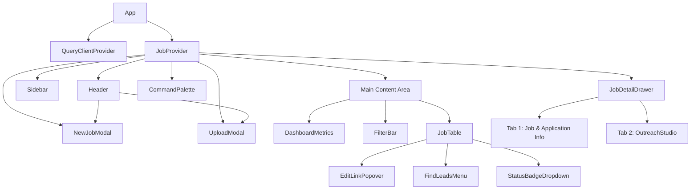

# Frontend Documentation

## Directory Tree

```
frontend/src/
├── App.tsx                   # Root: QueryClientProvider + JobProvider + Router
├── main.tsx                  # Entry point
├── index.css                 # Global CSS, design tokens
├── components/
│   ├── NewJobModal.tsx        # Modal for creating a new job from scratch
│   ├── auth/                 # Auth gate components (API key entry)
│   ├── common/               # Badge, StatusBadgeDropdown
│   ├── dashboard/            # DashboardMetrics (metric cards)
│   ├── detail/               # JobDetailDrawer, OutreachStudio, FindLeadsMenu
│   ├── layout/               # Header, Sidebar, main layout
│   ├── outreach/             # Outreach template components
│   ├── search/               # FilterBar, CommandPalette
│   ├── settings/             # SettingsModal
│   ├── table/                # JobTable, EditLinkPopover, cell renderers
│   ├── ui/                   # Generic UI primitives
│   └── upload/               # UploadModal (Excel import)
├── hooks/
│   └── useJobs.ts            # TanStack Query hooks
├── services/
│   ├── apiClient.ts          # Fetch wrapper, field mapping
│   └── excelAdapter.ts       # Excel parse + export (SheetJS/xlsx)
├── state/
│   └── useJobStore.tsx       # React Context store + JobProvider
├── types/
│   └── job.ts                # All TypeScript types (JobItem, FilterState, etc.)
└── utils/
    └── linkedinSearch.ts     # URL builders for LinkedIn people + job search
```

## Component Hierarchy Diagram



## State Management

The application state is managed using the **React Context API** through a custom `useJobStore` hook. This replaces external state management libraries like Zustand to reduce bundle size and leverage built-in React features.

The `JobProvider` wraps the application and provides the context. Several state properties are persisted to `localStorage` to maintain user preferences across sessions. The persisted properties include:
- `theme`
- `activeDomain`
- `viewMode`
- `sortBy` / `sortDirection`
- `userProfile`
- `isSidebarCollapsed`

## Filtering Pipeline

The displayed jobs in the table are computed through a series of filters applied sequentially to the raw data. This is typically done via `useMemo` to ensure performance.

**Pipeline Flow:**
`Raw Jobs` → `Domain Filter` → `ViewMode Filter` → `Priority Filter` → `WorkMode Filter` → `Status Filter` → `Tech Filter` → `Search Filter` → `Sort` → `Filtered Jobs`

## Metrics Computation

Metrics are computed based on the currently selected domain (or 'all'). The computations iterate over the job list to provide counts for:
- Total Jobs
- Jobs needing action (Ready to Apply)
- Applied Jobs
- Interviewing Jobs
- Offers
- Rejected
- High Priority Jobs (Top unapplied)

## Data Fetching

Data fetching is handled by TanStack Query (v5).

| Hook | Query Key | Stale Time | Purpose |
| --- | --- | --- | --- |
| `useJobs` | `['jobs']` | 5 mins | Fetches all jobs with Notes included |
| `useUpdateJob` | N/A | N/A | Updates a job. Performs optimistic UI update. |
| `useCreateJob` | N/A | N/A | Creates a new job. Invalidates `['jobs']` on success. |
| `useAddNote` | N/A | N/A | Adds a note to a job. Invalidates `['jobs']` on success. |
| `useCloneJob` | N/A | N/A | Clones a job. Invalidates `['jobs']` on success. |
| `useCheckDuplicateJob` | `['check-duplicate', company, role, id]` | 60 secs | Checks for duplicate job entries based on company and role. |

## Optimistic Updates

The `useUpdateJob` hook employs optimistic updates to provide a snappy user experience:
1. **Cancel pending queries:** Prevents race conditions.
2. **Snapshot previous cache:** Saves the current state for fallback.
3. **Mutate cache immediately:** Updates the UI before the server responds.
4. **Rollback on error:** Restores the previous cache if the mutation fails.
5. **Invalidate on settle:** Ensures data freshness by refetching on success or failure.

## Portal Pattern

Popovers (like `EditLinkPopover` and `FindLeadsMenu`) use React Portals (`createPortal`). This is essential to prevent them from being clipped by the `JobTable`'s `overflow: hidden` or `overflow: auto` CSS rules. 
The portals are appended to `document.body` and position themselves relative to their trigger elements using refs. They include global click and scroll event listeners to close themselves when the user clicks outside or scrolls the table.

## Row Virtualization

To handle hundreds or thousands of job entries without performance degradation, the `JobTable` uses `@tanstack/react-virtual`. It only renders the rows that are currently visible within the viewport scroll area, reusing DOM nodes as the user scrolls.

## LinkedIn Search

The `linkedinSearch.ts` utility provides two main functions for constructing LinkedIn search URLs:
- `buildLinkedInSearchUrl()`: Constructs a people search URL. It takes the company name (or URN), desired personas (e.g., recruiter, engineering manager), geographical criteria, and hiring filters.
- `buildLinkedInJobSearchUrl()`: Constructs a jobs search URL based on keywords, recency (e.g., `f_TPR=r86400` for past 24 hours), and an optional company URN.

## Field Mapping

The `apiClient.ts` maps fields between the backend models and the frontend `JobItem` interfaces:
- Backend `applicationLink` maps to Frontend `jobApplicationLink`
- Backend `techStack` (CSV string) maps to Frontend `techStack` (string array)
- Backend `notes` array is split into standard `notes` (General) and `jdContent` (JD type)
- Backend `domain` string is mapped to literal types (`sde`, `cloud`, `dual`, `general`)
- Backend `id` (integer) is mapped to string for frontend keys

## LocalStorage Keys

| Key | Purpose |
| --- | --- |
| `jobtracker_theme` | Stores 'dark' or 'light' preference |
| `jobtracker_domain` | Stores the active domain filter |
| `jobtracker_viewMode` | Stores the active view tab |
| `jobtracker_sort` | Stores `{ sortBy, sortDirection }` |
| `jobtracker_userProfile` | Stores user specific settings |
| `jobtracker_sidebar` | Stores boolean for collapsed state |
