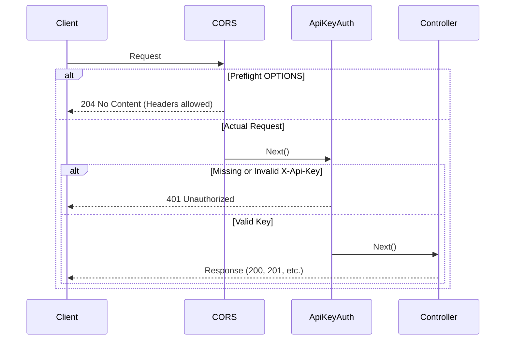

# Backend API Documentation

## Base Information

- **Production URL**: (Your Render deployment URL)
- **Development URL**: `http://localhost:5089`

## Authentication

The backend is secured using an API key mechanism via the `ApiKeyAuthMiddleware`. 
- **Header Required**: `X-Api-Key`
- **Configuration**: The valid key is stored in `appsettings.json` under `ApiKey`.
- **Development Default**: For local development, the key is `dev-local-key`.

## Complete Endpoints Table

| Controller | Method | Path | Auth Required | Params / Query | Body | Response |
| --- | --- | --- | --- | --- | --- | --- |
| Jobs | GET | `/api/jobs` | Yes | `status`, `priority`, `domain`, `search` | None | `List<Job>` with Notes |
| Jobs | GET | `/api/jobs/{id}` | Yes | `id` | None | `Job` with relations |
| Jobs | POST | `/api/jobs` | Yes | None | `JobCreateDto` | `Job` |
| Jobs | PATCH | `/api/jobs/{id}` | Yes | `id` | `JobUpdateDto` | `Job` |
| Jobs | DELETE | `/api/jobs/{id}` | Yes | `id` | None | `204 No Content` |
| Jobs | POST | `/api/jobs/{id}/clone` | Yes | `id` | None | `Job` |
| Jobs | GET | `/api/jobs/check-duplicate` | Yes | `companyName`, `targetRole`, `excludeJobId` | None | `{ isDuplicate: bool }` |
| Notes | GET | `/api/jobs/{jobId}/notes` | Yes | `jobId` | None | `List<Note>` |
| Notes | POST | `/api/jobs/{jobId}/notes` | Yes | `jobId` | `{ content, noteType }` | `Note` |
| Notes | DELETE | `/api/jobs/{jobId}/notes/{noteId}` | Yes | `jobId`, `noteId` | None | `204 No Content` |
| Outreach | GET | `/api/jobs/{jobId}/outreach` | Yes | `jobId` | None | `List<Outreach>` |
| Outreach | POST | `/api/jobs/{jobId}/outreach` | Yes | `jobId` | `OutreachDto` | `Outreach` |
| Dashboard | GET | `/api/dashboard/next-batch` | Yes | `count=8` | None | `List<Job>` |
| Dashboard | GET | `/api/dashboard/weekly-summary` | Yes | None | None | `MetricsDto` |
| Settings | GET | `/api/settings` | Yes | None | None | `SettingsDto` |
| Settings | PUT | `/api/settings` | Yes | None | `SettingsDto` | `SettingsDto` |
| JobApplicationImport | POST | `/api/jobs/import-from-automator` | Yes | None | `JobApplicationImportDto` | `201 Created` / `200 OK` (idempotent) |

## Detailed Endpoint Specs

*(Select Examples)*

### PATCH /api/jobs/{id}
**Request:**
```json
{
  "ApplicationStatus": "Applied",
  "Priority": "High"
}
```
**Response:** `200 OK`
Returns the updated Job object.

### POST /api/jobs/{id}/clone
**Request:** Empty body.
**Response:** `201 Created`
Returns the newly created Job object.

### POST /api/jobs/import-from-automator
Webhook endpoint called by the Python sidecar (`automation/gmail-jd-automator/main.py`) after processing an outreach email draft.
- **Idempotency**: Checks if `GmailDraftId` already exists. Returns `200 OK` if duplicate, `201 Created` if new.
- **Company Name Extraction**: Uses regex heuristics on `GeneratedSubject` and `RawJdText` to extract company names automatically.

**Request:**
```json
{
  "gmailDraftId": "18e47f9a123bc",
  "recipientEmail": "recruiter@acme.com",
  "generatedSubject": "Senior .NET Developer – ACME Corp",
  "generatedBodyPreview": "Hi John, I noticed your opening...",
  "status": "DRAFT CREATED",
  "rawJdText": "Senior .NET Developer at ACME Corp..."
}
```
**Response:** `201 Created` with full `Job` object.

## JobApplicationImportDto Fields

| Field | Type | Description |
| --- | --- | --- |
| `GmailDraftId` | string | Unique Gmail draft ID used as idempotency key |
| `RecipientEmail` | string | Email from the draft `To:` header |
| `GeneratedSubject` | string | Claude-generated email subject |
| `GeneratedBodyPreview` | string | First 300 characters of email body |
| `Status` | string | "DRAFT CREATED", "SENT", or "SKIPPED" |
| `RawJdText` | string | Extracted JD text (up to 2000 chars) for parsing |

## JobUpdateDto Fields

| Field | Type | Description |
| --- | --- | --- |
| ApplicationStatus | string | Job application status |
| Priority | string | High, Medium, Low |
| NextAction | string | Suggested next step |
| TargetRole | string | Role title |
| Location | string | Job location |
| WorkMode | string | Remote, Hybrid, On-site |
| ApplicationLink | string | URL |
| TechStack | string | CSV of technologies |
| CareerPageLink | string | URL |
| ReferralNeeded | bool? | Nullable boolean |
| ReferralContactName | string | Name of contact |
| HrRecruiterName | string | Name of recruiter |
| GmailDraftId | string | Unique Gmail draft ID |
| AutomatorStatus | string | "Draft Created", "Sent", "Skipped" |
| OutreachSubject | string | Generated outreach subject |
| OutreachBodyPreview | string | Generated outreach snippet |

## Clone Job Logic

When a job is cloned:
1. The new job inherits: `CompanyName`, `Location`, `WorkMode`, `Domain`, `CareerPageLink`, `HrRecruiterName`.
2. The new job resets: `TargetRole` (empty), `ApplicationLink` (null), `Status` ('Not Started'), `AppliedDate` (null), `Priority` ('Medium'), `NextAction` ('Apply and send outreach').
3. The new job sets `ClonedFromJobId` to the ID of the original job to maintain lineage.

## Duplicate Check Logic

The duplicate check endpoint (`GET /api/jobs/check-duplicate`) evaluates if a job with the same `companyName` and `targetRole` already exists. 
- It uses the optional `excludeJobId` parameter to ignore the current job when editing an existing record.
- Jobs with statuses indicating they are archived or completely rejected may be exempted based on specific business rules.

## Auto-Applied Date

When updating a job's `ApplicationStatus` to `Applied` via a PATCH request, the backend checks if `AppliedDate` is null. If it is, the backend automatically sets it to the current UTC date.

## CORS Policy

The CORS policy `AllowFrontend` is configured to allow requests from any origin (`AllowAnyOrigin()`), with any method and header. This accommodates the frontend deployed on Vercel or running locally.

## Middleware Pipeline Sequence Diagram



## Error Responses

- **401 Unauthorized**: Missing or invalid `X-Api-Key` header.
- **400 Bad Request**: Validation failure (missing required fields, invalid JSON).
- **404 Not Found**: The requested resource (Job, Note, etc.) does not exist.
- **500 Internal Server Error**: Unhandled backend exception.

## Project Structure

```
backend/
├── Controllers/
│   ├── JobsController.cs
│   ├── NotesController.cs
│   ├── OutreachController.cs
│   ├── DashboardController.cs
│   ├── SettingsController.cs
│   └── JobApplicationImportController.cs  # Automator webhook import
├── Data/
│   ├── ApplicationDbContext.cs
│   └── Migrations/
├── DTOs/
│   ├── JobCreateDto.cs
│   ├── JobUpdateDto.cs
│   ├── JobApplicationImportDto.cs         # Automator payload DTO
│   └── ...
├── Middleware/
│   └── ApiKeyAuthMiddleware.cs
├── Models/
│   ├── Job.cs                             # Contains AutomatorStatus, GmailDraftId
│   ├── Note.cs
│   └── OutreachTemplateUsed.cs
├── Program.cs
└── appsettings.json
```
