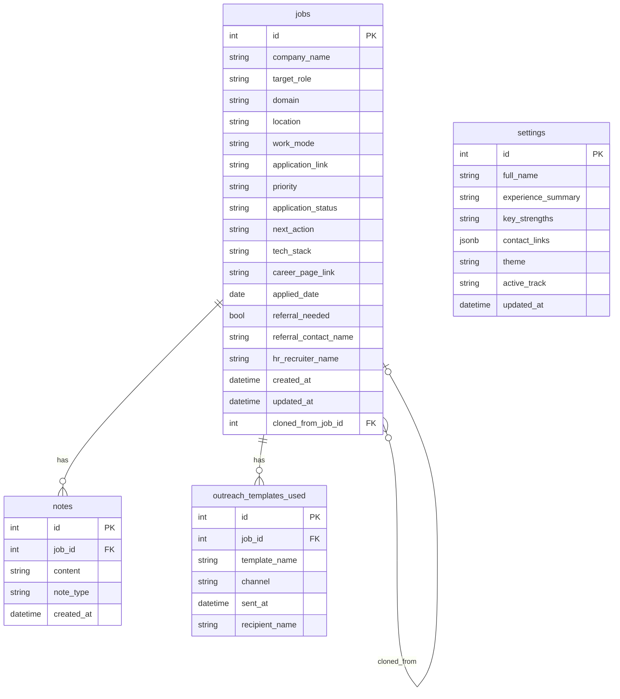

# Database Documentation

## Connection

The application connects to a managed PostgreSQL instance provided by Supabase.
- **Host**: `db.sadtwqnfpmpoxzqwrquh.supabase.co`
- **Port**: 5432
- **Version**: PostgreSQL 15
- **Security**: SSL Required
- **Provider**: The backend API connects to this database using the Npgsql EF Core provider.

## ER Diagram

## Table Schemas

### `jobs`
| Column Name | Type | Nullable | Default | Description |
|-------------|------|----------|---------|-------------|
| `id` | int | No | Auto-increment | Primary key |
| `company_name` | string | No | - | Name of the company |
| `target_role` | string | No | - | Role applied for |
| `domain` | string | No | - | e.g. SDE / FullStack, Cloud / DevOps |
| `location` | string | Yes | - | Job location |
| `work_mode` | string | Yes | - | Remote, Hybrid, On-site |
| `application_link` | string | Yes | - | Link to the application/posting |
| `priority` | string | Yes | - | High, Medium, Low |
| `application_status` | string | No | - | Current application status |
| `next_action` | string | Yes | - | Follow-up action required |
| `tech_stack` | string | Yes | - | Required technologies |
| `career_page_link` | string | Yes | - | Company career page |
| `applied_date` | date | Yes | - | Date application submitted |
| `referral_needed` | bool | No | false | If referral is sought |
| `referral_contact_name` | string | Yes | - | Contact person for referral |
| `hr_recruiter_name` | string | Yes | - | HR/Recruiter name |
| `created_at` | datetime | No | CURRENT_TIMESTAMP | Record creation timestamp |
| `updated_at` | datetime | No | CURRENT_TIMESTAMP | Record update timestamp |
| `cloned_from_job_id`| int | Yes | null | Self-referencing FK for cloned jobs |

### `notes`
| Column Name | Type | Nullable | Default | Description |
|-------------|------|----------|---------|-------------|
| `id` | int | No | Auto-increment | Primary key |
| `job_id` | int | No | - | Foreign key to `jobs` |
| `content` | string | No | - | Note content |
| `note_type` | string | No | - | Type of note |
| `created_at` | datetime | No | CURRENT_TIMESTAMP | Note creation timestamp |

### `outreach_templates_used`
| Column Name | Type | Nullable | Default | Description |
|-------------|------|----------|---------|-------------|
| `id` | int | No | Auto-increment | Primary key |
| `job_id` | int | No | - | Foreign key to `jobs` |
| `template_name` | string | No | - | Name of the template used |
| `channel` | string | No | - | Communication channel (e.g., LinkedIn, Email) |
| `sent_at` | datetime | No | CURRENT_TIMESTAMP | When it was sent |
| `recipient_name` | string | Yes | - | Name of the recipient |

### `settings`
| Column Name | Type | Nullable | Default | Description |
|-------------|------|----------|---------|-------------|
| `id` | int | No | Auto-increment | Primary key |
| `full_name` | string | No | - | User's full name |
| `experience_summary` | string | Yes | - | Summary of experience |
| `key_strengths` | string | Yes | - | User's key strengths |
| `contact_links` | jsonb | Yes | - | JSON holding various links |
| `theme` | string | No | - | App theme setting |
| `active_track` | string | No | - | Currently active application track |
| `updated_at` | datetime | No | CURRENT_TIMESTAMP | Record update timestamp |

## Indexes
- `idx_jobs_status`: Index on `jobs.application_status` for faster status-based filtering.
- `idx_jobs_priority`: Index on `jobs.priority` for quick priority sorting.
- `idx_jobs_domain`: Index on `jobs.domain` for efficient domain filtering.

## Relationships
The database utilizes cascade deletion for dependent records. When a `job` is deleted:
- All associated `notes` are automatically deleted.
- All associated `outreach_templates_used` are automatically deleted.
The self-referencing relationship `cloned_from_job_id` typically uses a SET NULL or restricted delete behavior to prevent cascading deletions across cloned job entries.

## Migrations
The database schema is managed via Entity Framework Core migrations:
- `20260810160100_InitialCreate` — Created the `jobs`, `notes`, `outreach_templates_used`, and `settings` tables with their initial schema.
- `20260811111744_AddClonedFromJobId` — Added the self-referencing `cloned_from_job_id` foreign key to the `jobs` table to track job duplications/clones.

## Note Types
The `notes.note_type` column stores values based on a `NoteType` enum:
- `General`: Used for free-form notes, observations, or general context.
- `JD`: Used specifically for storing job description content or excerpts.
- `Link`: Used for storing URL references or related links.

## Domain Values
The `jobs.domain` column categorizes the target area of the job application. It stores one of the following string values:
- `'SDE / FullStack'` (Maps to frontend as `sde`)
- `'Cloud / DevOps'` (Maps to frontend as `cloud`)
- `'Dual Domain'` (Maps to frontend as `dual`)
