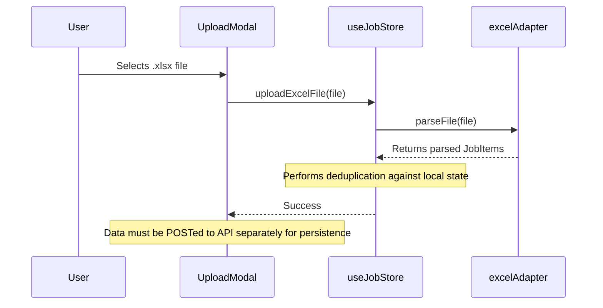
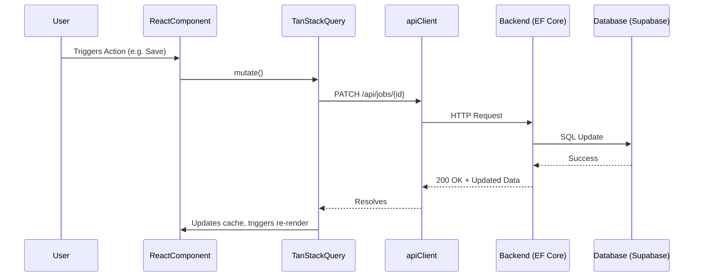
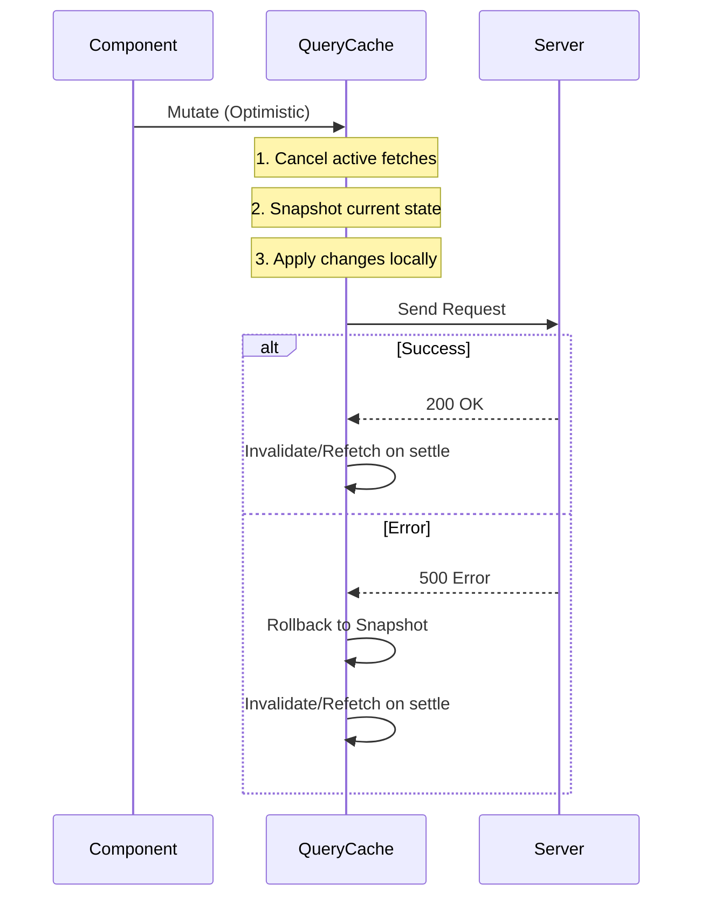
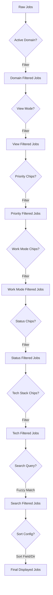

# Data Flow Documentation

## Excel Import Flow

The Excel import relies heavily on client-side parsing before interacting with the application state and backend.

*Note: While `uploadExcelFile` performs deduplication in memory, for DB persistence, the parsed jobs are sent to the backend via POST requests.*

## Standard CRUD Flow

## Optimistic Update Flow

When updating a job, the UI reflects the change immediately before the server confirms it.

## JD / Notes Save Flow

1. User types in the `JobDetailDrawer` textarea.
2. The UI fires a `useAddNote` mutation (with type=JD) alongside a `useUpdateJob` mutation.
3. The server stores the note in the `Notes` table linked to the job.
4. On data refetch, `mapJobToFrontend` in the client extracts the JD content from the returned notes array.

## Status Change Flow

1. User clicks the `StatusBadgeDropdown` and selects a new status (e.g., 'Applied').
2. `useUpdateJob` triggers a PATCH request with `{ ApplicationStatus: 'Applied' }`.
3. If the backend detects the transition to 'Applied' and `AppliedDate` is null, it auto-sets `AppliedDate` to UTC now.

## LinkedIn People Search Flow

1. User clicks in `FindLeadsMenu`.
2. Triggers `buildLinkedInSearchUrl()` locally with parameters (company, persona, etc.).
3. Executes `window.open(url, '_blank')`.
4. *No server call is made.*

## LinkedIn Job Search Flow

1. User interacts with `FindLeadsMenu` or Header button.
2. Triggers `buildLinkedInJobSearchUrl()` with keywords and recency.
3. Executes `window.open(url, '_blank')`.
4. *No server call is made.*

## Duplicate Check Flow

1. User types in the target role input in the drawer/modal.
2. Changes are debounced by 400ms.
3. `useCheckDuplicateJob` is enabled if both company and role are present.
4. GET `/api/jobs/check-duplicate?companyName=X&targetRole=Y&excludeJobId=Z`.
5. Returns `{ isDuplicate: true/false }` which shows/hides an inline warning in the UI.

## Clone Job Flow

1. User clicks the Clone button on a job.
2. `useCloneJob` mutation triggers POST `/api/jobs/{id}/clone`.
3. Backend duplicates the job (resetting specific fields, inheriting others) and returns the new job.
4. TanStack Query invalidates `['jobs']`.
5. The new job appears in the table.
6. The UI automatically opens the `JobDetailDrawer` for the newly cloned job.

## Theme Toggle Flow

1. User clicks the theme toggle in the Header.
2. `toggleTheme()` in `useJobStore` updates state.
3. A `useEffect` hook reacts: adds/removes `dark`/`light` classes on the HTML `document.documentElement`.
4. The preference is written to `localStorage.setItem('jobtracker_theme', theme)`.

## Search / Filter Pipeline Diagram

