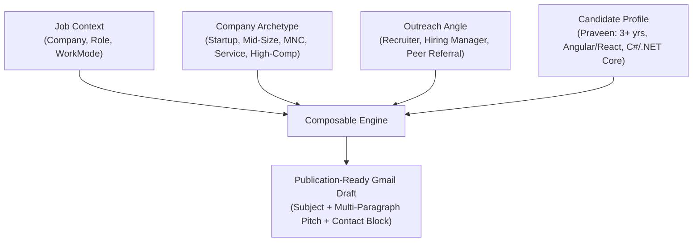

# Multi-Dimensional Composable Outreach Matrix Guide

This guide details the architectural design, matrix permutations, and recruiter expectations for NextApply's **Multi-Dimensional Composable Outreach Engine**.

---

## 1. Why a Composable Matrix is Superior to a Static Database Table

| Dimension | Static Database Approach (Anti-Pattern) | Composable Matrix Engine (NextApply) |
|---|---|---|
| **Storage & Overhead** | Heavy SQL tables (`draft_templates`, `draft_variations`), schema migrations, SQL seeding scripts. | **Zero Database Bloat**: Pure TypeScript functional composition with 0 bytes of DB overhead. |
| **Availability & Latency** | Network round-trip, database connection latency, fails if PostgreSQL is unreachable. | **0ms Instant Synthesis**: Runs purely client-side; works 100% offline and on static serverless hosts (Vercel). |
| **Permutation Flexibility** | Requires pre-generating hundreds of static permutations ($5 \text{ scales} \times 3 \text{ modes} \times 3 \text{ angles} = 45\text{+} \text{ static rows}$). | **Dynamic Combinatorial Generation**: Synthesizes custom permutations on the fly by combining modular slot blocks. |
| **Maintenance & Profile Drift** | Changing candidate profile requires bulk SQL updates across all stored drafts. | **Real-Time Profile Grounding**: Automatically pulls candidate name, role, 3+ years experience, stack, and contact links on invocation. |

---

## 2. The Multi-Dimensional Matrix Architecture

Every cold outreach email is dynamically synthesized from 4 composable building blocks:

---

## 3. Dimension 1: Work Mode Alignment

### 🏠 Remote
- **Recruiter Concern**: Will the candidate require constant hand-holding or disappear across distributed timezones?
- **Engineered Pitch**: Highlights self-directed autonomy, proactive async documentation (RFCs, PR descriptions), Loom walkthroughs, and clean distributed timezone overlap.
- **Sample Hook**:
  > *"Operating fully remotely, I bring strong self-directed autonomy, documentation-first communication, and proactive Slack/Loom/PR discipline. I am experienced in collaborating across distributed timezones and maintaining high shipping velocity without needing synchronous supervision."*

### 🏢 Hybrid
- **Recruiter Concern**: Does the candidate understand how to maximize the value of in-office vs remote days?
- **Engineered Pitch**: Emphasizes using in-office days for high-bandwidth whiteboard architecture and cross-functional pairing, while using remote days for uninterrupted deep implementation work.
- **Sample Hook**:
  > *"I thrive in a hybrid model—using in-office days for high-bandwidth whiteboard architecture, sprint planning, and cross-functional pairing, while leveraging remote days for deep, uninterrupted implementation work."*

### 🏙️ Onsite
- **Recruiter Concern**: Is the candidate committed to physical presence and high-energy collaborative problem-solving?
- **Engineered Pitch**: Highlights zero-latency in-person whiteboarding, immediate feedback loops on architecture and code reviews, and building deep team camaraderie.
- **Sample Hook**:
  > *"I am excited about working onsite with the team. In-person collaboration allows for zero-latency whiteboarding, immediate feedback loops on code reviews, and building deep team camaraderie to tackle complex technical hurdles together."*

---

## 4. Dimension 2: Company Scale & Sector Archetypes

### 🚀 1. Startup (0-to-1 / Early Growth)
- **Ethos**: Speed, ownership, high agency, zero bureaucracy, wearing multiple hats.
- **Engineered Pitch**:
  > *"I love the speed, ownership, and high agency required at {company}. As an engineer who thrives in fast-paced 0-to-1 environments, I wear multiple hats—translating customer needs into production code fast, preventing technical debt from accumulating, and shipping features end-to-end."*

### 📈 2. Mid-Size / Scale-Up (1-to-10 / Series C-E / Unicorns)
- **Ethos**: Transitioning from MVP to scale, breaking monolithic bottlenecks, establishing microservice boundaries, CI/CD automation.
- **Engineered Pitch**:
  > *"At {company}'s current stage of rapid scale, the engineering challenge shifts from initial MVP to breaking bottlenecks, decomposing monolithic services, and elevating platform reliability. I specialize in building modular systems that allow teams to ship faster without compromising system stability."*

### 🌐 3. MNC / Big Tech / Global Tech Giants
- **Ethos**: p99 tail latency, 99.999% SLAs, architectural RFC consensus, observable microservices, global compliance.
- **Engineered Pitch**:
  > *"I admire {company}'s engineering rigor in managing large-scale distributed architectures with strict p99 latency SLAs and five-nines availability. I bring deep experience working with clean architectural RFCs, automated CI/CD guardrails, and observable microservices at scale."*

### 💼 4. Service / IT Solutions / Global Consulting (TCS, Infosys, Wipro, Accenture, Cognizant)
- **Ethos**: Client delivery velocity, enterprise cloud modernization (.NET Framework to .NET Core/Cloud), agile sprint milestones, stakeholder communication.
- **Engineered Pitch**:
  > *"I understand the high-stakes demands of enterprise client delivery, digital transformation, and legacy modernization at {company}. I excel at rapidly ramping up on complex client domains, modernizing legacy .NET architectures to cloud-native microservices, and delivering dependable milestone releases on schedule."*

### ⚡ 5. High-Comp Quant, FinTech & Deep Tech (From 500 Highest-Paying List: Citadel, Stripe, OpenAI, Snowflake)
- **Ethos**: Zero tolerance for data anomalies, sub-millisecond execution, idempotent APIs, transactional atomicity, compute efficiency.
- **Engineered Pitch**:
  > *"Building systems for {company} demands absolute correctness, low tail latency, and zero tolerance for data anomalies. I bring a disciplined engineering methodology focused on idempotent APIs, resilient asynchronous pipelines, and optimal compute efficiency under high throughput."*

---

## 5. Dimension 3: Outreach Angles

1. **Direct Recruiter (<120 words)**: Concise, mobile-scannable bulleted summary optimized for talent acquisition partners screening 150+ applicants daily.
2. **Hiring Manager (Technical & p99 Architecture)**: Deep technical pitch highlighting domain-driven design, microservice decoupling, low p99 latencies, and stack compatibility.
3. **Peer / Alumni Referral Request**: Warm, respectful outreach asking an engineering peer for cultural insights and an internal referral into the ATS.

---

## 6. Real-Time Candidate Profile Grounding

All generated drafts dynamically ground in Praveen's exact profile:
- **Candidate Name**: Praveen Kashyap
- **Role**: Full Stack Engineer / SDE
- **Experience**: 3+ years
- **Key Technical Strengths**: Angular, React, TypeScript, C#, .NET Core, Microservices, Cloud Architecture
- **Contact**: `2pkashyap2001@gmail.com` | `+91 7394990738`
- **Online Links**: [LinkedIn](https://www.linkedin.com/in/coder-pro10z/) | [GitHub / Portfolio](https://github.com/coder-pro10z)
