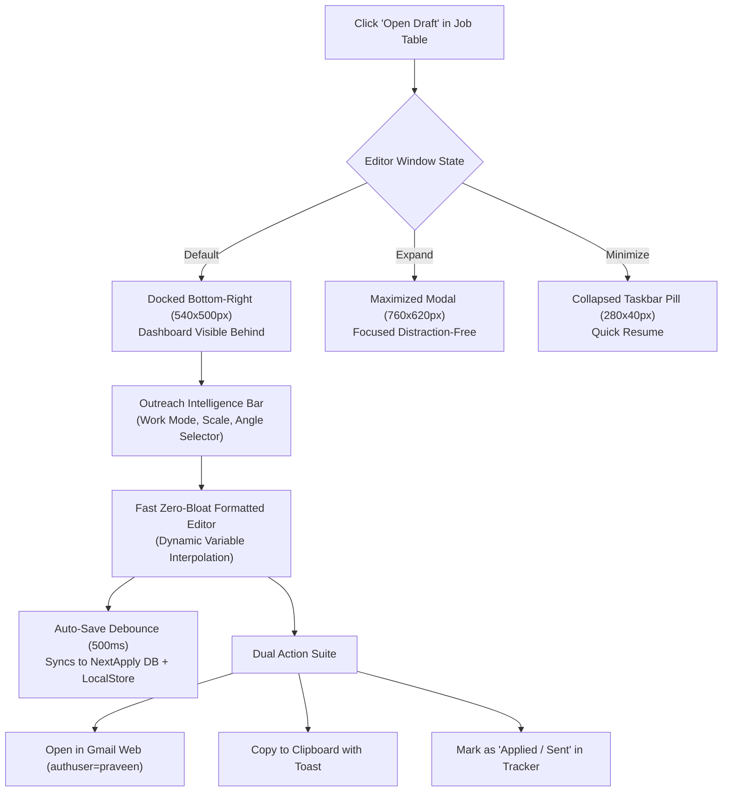

# Native "Draft Preview & Editor" Popup — Specification, Review & Improvement Plan

This document preserves the foundational design proposal for the native **"Draft Preview & Editor"** popup (The Dark Gmail Aesthetic), followed by an **In-Depth Architectural Review** and **Actionable Technical Enhancements** tailored for the NextApply Job Tracker platform.

---

# Part 1: Original Design Proposal

## 1. UI/UX Design Strategy: "The Dark Gmail Aesthetic"
The goal is to blend your application's Dark Mode/Modern Tech aesthetic with Gmail’s functional layout.
- **Color Palette**: Use your app’s background (`#0B0D0E` or similar) for the modal, with slightly lighter borders (`#1E293B`) to define sections.
- **Typography**: Keep the clean sans-serif font used in your dashboard.
- **Corner Radii**: Use a consistent 8px to 12px border-radius to match your "Open Draft" buttons.
- **The "Gmail Pop-out" Behavior**: Instead of a centered modal, consider placing it in the bottom-right corner (like Gmail) if the user wants to reference the dashboard while editing, OR a centered overlay for focused editing.

## 2. Component Structure (The Layout)

### A. The Header (Control Bar)
- **Title**: Display the Subject Line (e.g., *"Draft: Senior Full Stack Engineer - Stripe"*).
- **Actions**: Minimize, Full-screen, and Close (X) icons on the right.
- **Style**: Darker background than the body to create a "header" feel.

### B. The Recipient Stack (Metadata)
Use a "Label: Value" format that is clean and readable:
- **From**: (Read-only or dropdown) Connected email (`2pkashyap2001@gmail.com`).
- **To**: Input field with the recruiter's email.
- **CC/BCC**: Hidden by default with a "Cc/Bcc" toggle button on the right of the "To" field (exactly like Gmail).
- **Subject**: A borderless input field with a divider line underneath.

### C. The Content Area (Rich Text Editor)
- **Body**: Rich Text Editor (like TipTap or Quill.js).
- **Placeholders**: *"Write your outreach here..."*
- **Signature**: Automatically appended at the bottom, separated by standard `--` or subtle horizontal rule.

### D. The Footer (Actions)
- **Primary Button**: Solid Blue "Send" button (matching "Run Online Automator" button style).
- **Formatting Tools**: Sub-toolbar with Bold, Italic, Link, and List icons.
- **Utility Icons**: Attachment (paperclip), Insert Image, and Trash icon on the far right.

## 3. Technical Implementation Plan
- **Step 1: Framework Choice**: Use React with accessible dialog components (Radix UI / custom modal).
- **Step 2: State Management**: `currentDraft` state with `id`, `to`, `cc`, `bcc`, `subject`, `body`, `signature`, `attachments`.
- **Step 3: CSS/Styling**: Tailwind / design-token classes with dark slate palette and subtle borders.

## 4. Integration with Dashboard
- **Trigger**: User clicks "Open Draft" button in the Actions column.
- **Visual Transition**: Slide up from bottom right or scale up from center.
- **Real-time Sync**: Auto-save draft changes back to Job Tracker state with "Saved" indicator.
- **Closing**: Discard prompt or automatic background draft sync.

## 5. Visual Mockup Concept
```html
<!-- Main Modal Window -->
<div class="w-full max-w-2xl bg-[#0F1115] rounded-xl border border-slate-800 shadow-2xl overflow-hidden">
  <!-- Header -->
  <div class="bg-[#16191E] px-4 py-2 flex justify-between items-center border-b border-slate-800">
    <span class="text-sm font-medium text-slate-300">New Message</span>
    <div class="flex gap-2">
      <button class="hover:bg-slate-700 p-1 rounded">_</button>
      <button class="hover:bg-red-900 p-1 rounded text-slate-400">✕</button>
    </div>
  </div>

  <!-- Fields -->
  <div class="px-4 py-1">
    <div class="flex border-b border-slate-800 py-2 items-center">
      <span class="text-slate-500 mr-2 text-sm w-12">To</span>
      <input class="bg-transparent flex-1 text-sm outline-none text-slate-200" value="recruiting@stripe.com">
      <span class="text-xs text-blue-400 cursor-pointer">Cc Bcc</span>
    </div>
    <div class="border-b border-slate-800 py-2">
      <input class="bg-transparent w-full text-sm outline-none text-slate-200 font-semibold" placeholder="Subject">
    </div>
  </div>

  <!-- Body / Editor -->
  <div class="p-4 h-96 overflow-y-auto text-slate-300 text-sm leading-relaxed">
     <!-- Rich Text Editor Component Goes Here -->
  </div>

  <!-- Footer Toolbar -->
  <div class="p-4 border-t border-slate-800 flex justify-between items-center bg-[#0F1115]">
    <div class="flex items-center gap-4">
      <button class="bg-blue-600 hover:bg-blue-700 text-white px-6 py-2 rounded-full font-medium text-sm">
        Send
      </button>
    </div>
  </div>
</div>
```

---

# Part 2: Review & Architectural Improvement Plan

While the original proposal provides a strong conceptual foundation, analyzing NextApply’s existing architecture (TypeScript, React 18, TanStack Query, offline/dual-mode cache, and `RULES.md` design governance) reveals several critical areas for improvement:



---

### Improvement 1: Strict Compliance with Design System & `RULES.md`
- **Issue in Initial Mockup**: The draft mockup included raw Unicode emojis (`📎`, `🗑️`, `A`). Under NextApply’s strict design guidelines (`RULES.md`), raw platform emojis are prohibited in interactive UI controls because of cross-platform rendering artifacts (Windows Segoe vs Apple Color Emoji vs Linux).
- **Enhancement**: Use official **Lucide React SVG icons** exclusively:
  - Header controls: `<Minus size={14} />`, `<Maximize2 size={14} />`, `<Minimize2 size={14} />`, `<X size={14} />`
  - Recruiter info: `<Mail size={13} />`, `<User size={13} />`
  - Formatting toolbar: `<Bold size={13} />`, `<Italic size={13} />`, `<List size={13} />`, `<Link2 size={13} />`, `<Sparkles size={13} />`
  - Footer actions: `<Send size={13} />`, `<ExternalLink size={13} />`, `<Copy size={13} />`, `<Trash2 size={13} />`
- **Design Tokens**: Instead of hardcoding `#0B0D0E` and `border-slate-800`, use NextApply's CSS variables:
  - Background: `var(--bg-secondary)` (card) & `var(--bg-tertiary)` (header & inputs)
  - Borders: `var(--border-color)`
  - Primary Accent: `var(--accent-primary)` (Raycast blue / `#3b82f6`)
  - Typography: `inherit`, `var(--font-sans)` with tabular numbers for status badges.

---

### Improvement 2: Tri-State Window Behavior (Docked vs Maximized vs Minimized)
A static centered modal prevents the candidate from looking at notes, company research, and recruiter details on the main dashboard while drafting. 
- **Tri-State Pop-Out Architecture**:
  1. **Docked Mode (Default)**: Fixed to bottom-right (`bottom: 0; right: 28px; width: 560px; height: 520px; z-index: 1050; border-bottom: none; border-radius: 12px 12px 0 0;`). The dashboard remains fully interactive!
  2. **Maximized Mode**: Centered modal overlay (`width: 800px; height: 640px;`) with a subtle `rgba(0,0,0,0.6)` backdrop blur for distraction-free long-form writing.
  3. **Minimized Mode**: Collapses into a sleek bottom-right floating pill (`width: 300px; height: 40px;`) showing:
     - Status dot (Green / Blue)
     - Company & Role (e.g. *"Stripe – Full Stack"*)
     - Click to instantly restore without losing state.

---

### Improvement 3: Zero-Bloat Formatted Editor (Avoid Heavy Rich-Text Engines)
- **Issue**: Introducing full WYSIWYG engines like TipTap or Quill adds **250KB–400KB** of heavy external dependencies, requires complicated HTML-to-plaintext conversion for Gmail mailto URLs, and often breaks line break encoding (`\n\n`) when launching Gmail.
- **Enhancement**: Implement a lightweight, zero-dependency **Markdown & Formatted Textarea** with a 1-click formatting toolbar:
  - Formatting buttons inject standard Markdown / formatting tokens:
    - **Bold**: wraps selection with `**bold**`
    - **Italic**: wraps selection with `*italic*`
    - **Bullet List**: prepends lines with `• `
    - **Link**: formats as `[Title](URL)`
  - Direct 1:1 fidelity with Gmail compose URLs: text copied or sent to Gmail opens cleanly without rogue HTML tags or unescaped entities.

---

### Improvement 4: Integrated "Outreach Intelligence Bar"
Connect the editor directly with NextApply's new **Multi-Dimensional Composable Matrix Engine**:
- A compact toolbar above the body text allows 1-click re-generation:
  - **Work Mode**: Toggle `Remote` | `Hybrid` | `Onsite` (instantly updates the work-mode paragraph).
  - **Company Archetype**: Toggle `Startup` | `Mid-Size` | `MNC` | `Service` | `High-Comp Quant/FinTech`.
  - **Outreach Angle**: Toggle `Direct Recruiter` | `Hiring Manager Technical` | `Peer Referral`.
  - **Blueprints Dropdown**: Instant access to company-specific blueprints (Uber, Netflix, Google, Stripe, Razorpay, Atlassian, etc.).
- If the candidate discovers the contact is an Engineering Manager rather than an HR recruiter, a single click seamlessly switches the tone from high-level to architectural depth (p99 latency, microservice decoupling).

---

### Improvement 5: Multi-Action Workflow (Send, Web Gmail, Copy, Status Update)
Cold outreach in a job tracker requires more than just an email window—it needs seamless workflow integration:
1. **"Open in Gmail Web" (`authuser=2pkashyap2001@gmail.com`)**:
   - Launches Gmail Compose with the exact edited Subject, Recruiter Email, and Body pre-filled.
2. **"Copy Formatted Email"**:
   - Copies Subject and Body to clipboard with a 2-second visual checkmark toast.
3. **"Mark as Applied & Save"**:
   - Updates the job status to `Applied` in the tracker, sets `applied_date = today`, logs notes, and saves the draft in the job record.
4. **Debounced Auto-Save (500ms)**:
   - As the candidate types, changes persist to `outreachSubject` and `outreachBodyPreview` in local state / backend API, with a subtle `"Draft Saved ✓"` indicator in the footer.

---

## 6. Proposed React Component Architecture

```typescript
// Proposed Component: frontend/src/components/outreach/GmailDraftEditorModal.tsx

interface GmailDraftEditorModalProps {
  isOpen: boolean;
  onClose: () => void;
  job: JobItem;
  userProfile: UserProfile;
}

export type EditorWindowState = 'docked' | 'maximized' | 'minimized';

export const GmailDraftEditorModal: React.FC<GmailDraftEditorModalProps> = ({
  isOpen,
  onClose,
  job,
  userProfile
}) => {
  const [windowState, setWindowState] = useState<EditorWindowState>('docked');
  const [to, setTo] = useState(job.hrRecruiterName || '');
  const [showCc, setShowCc] = useState(false);
  const [cc, setCc] = useState('');
  const [subject, setSubject] = useState(job.outreachSubject || '');
  const [body, setBody] = useState(job.outreachBodyPreview || '');
  const [saveStatus, setSaveStatus] = useState<'saved' | 'saving' | 'dirty'>('saved');

  // Debounced auto-save hook
  // Live composable matrix engine hooks
  // Gmail handoff action generator
  ...
};
```

---

## 7. Roadmap & Action Items

| Phase | Milestone | Priority |
|---|---|:---:|
| **Phase 1** | Create `GmailDraftEditorModal.tsx` supporting Docked / Maximized / Minimized window states | High |
| **Phase 2** | Integrate `composeOutreachEmail()` matrix bar inside the editor for live 1-click re-generation | High |
| **Phase 3** | Replace direct external tab trigger in `JobApplicationPanel.tsx` with the native popup trigger | Medium |
| **Phase 4** | Implement auto-save debounce syncing to NextApply job state and toast notifications | High |
| **Phase 5** | Add 1-click "Open in Gmail Web" and "Mark as Applied & Update Tracker" buttons | High |
